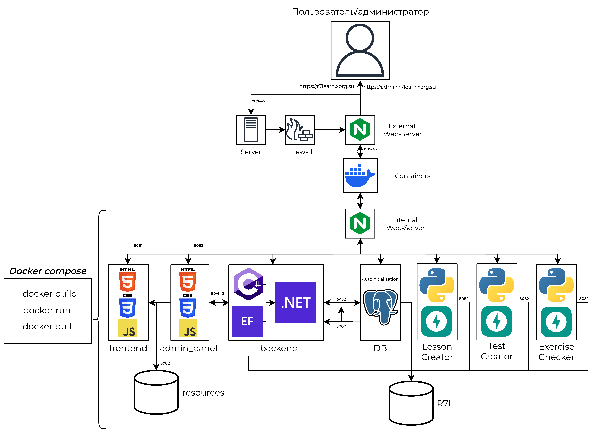

# r7learn Platform

## Components

- **frontend** — (r7learn.xorg.su)
- **admin_panel** — (admin.r7learn.xorg.su)
- **backend** — ASP.NET Core
- **converter** — docx → markdown converter
- **TestCreator** — test generator from txt
- **nginx** — internal reverse-proxy for services
- **EXTERNAL_nginx_configurations** — external nginx configs for VDS

---

## Architecture Diagram



## Directory Structure

```sh
R7L-full/
├── admin_panel/         # Admin panel (frontend for admins)
├── backend/             # Backend (ASP.NET Core)
├── converter/           # docx → markdown converter service
├── TestCreator/         # Test generator
├── frontend/            # Main user frontend
├── nginx/               # Nginx configs and .htpasswd
├── resources/           # Uploaded files
├── docker-compose.yml   # Docker Compose configuration
├── .env                 # Environment variables
```

## Environment Variables

- `POSTGRES_USER` — database user name
- `POSTGRES_PASSWORD` — database user password
- `POSTGRES_DB` — database name

---

## Quick Start (Recommended)

> **Use provided scripts for fast setup and maintenance**

```sh
cd /opt/R7L_full/scripts

bash make.sh

bash cleanup.sh
```

---

## Fully Manual Start (Step-by-step Guide)

### 1. Clone the repository

```sh
cd /opt/
git clone https://github.com/VLADos-IT/R7L_full.git
cd R7L_full
```

### 2. Build and run all services

```sh
docker compose build
docker compose up -d
```

### 3. Nginx and Let's Encrypt

```sh
cp /opt/R7L-full/EXTERNAL_nginx_configurations/r7learn.xorg.su.conf /etc/nginx/sites-available/
ln -s /etc/nginx/sites-available/r7learn.xorg.su.conf /etc/nginx/sites-enabled/
cp /opt/R7L-full/EXTERNAL_nginx_configurations/admin.r7learn.xorg.su.conf /etc/nginx/sites-available/
ln -s /etc/nginx/sites-available/admin.r7learn.xorg.su.conf /etc/nginx/sites-enabled/
cp /opt/R7L-full/nginx/.htpasswd /etc/nginx/
systemctl start nginx
certbot --nginx -d r7learn.xorg.su -d admin.r7learn.xorg.su
systemctl restart nginx
```

### 4. Fix access rights for uploads

```sh
chown -R 101:101 ./resources
```

### 5. Check the services

- **User interface:**  <https://r7learn.xorg.su>
- **Admin panel:**  <https://admin.r7learn.xorg.su>

---

## Update

> **Recommended:**  
> Use the script:  
> `bash scripts/update.sh`

Or manually:

```sh
git pull
docker compose build
docker compose up -d
```

---

## Uninstall

> ⚠️ **WARNING:**  
> `docker compose down -v --remove-orphans` will remove all Docker volumes, including your database volume.  
> **This will erase all database data!**  
> Use with caution and only if you have backups or do not need the data.

```sh
docker compose down
docker system prune -a --volumes --force &&  docker builder prune --all --force
docker compose down -v --remove-orphans
rm -rf /etc/nginx/sites-enabled/r7learn.xorg.su.conf
rm -rf /etc/nginx/sites-enabled/admin.r7learn.xorg.su.conf
systemctl reload nginx
```

---

## LetsEncrypt SSL certs delete

```sh
certbot delete --cert-name r7learn.xorg.su
certbot delete --cert-name admin.r7learn.xorg.su
```
